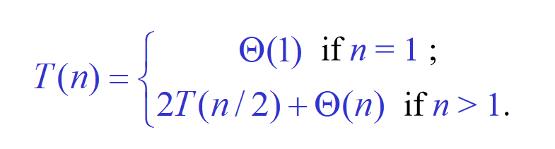

排序算法：
- 插入排序：每次前i个元素都是排序好的。T(n)=cita(n^2)
- 归并排序：每次把要排的序列切半，分别排序后再融合。融合的时间为cita(n)，
	- 
循环不变量：
- **初始化（Initialization）**：在第一次进入循环之前，它为真。
- **保持（Maintenance）**：如果它在某次循环迭代之前为真，那么在下一次迭代之前仍然为真。
- **终止（Termination）**：当循环终止时，这个不变式提供了一个有用的性质，帮助证明算法是正确的。
时间复杂度分析：最差情况，平均情况，最好情况（忽略跟机器有关的常数，渐进式算法，即关注T随n的增长）
cita(g(n)) = {f(n) : there exist positive constants  c1, c2, and n0 such that 0 ≤ c1g(n) ≤f(n) ≤ c2g(n) for all n ≥ n0}
f(n) = O(g(n)) if 存在 const c, n0 such that 0≤f(n)≤cg(n), 任意n≥n0.
Ω(g(n)) = {f(n): 存在 const c, n0 such that 0≤cg(n)≤f(n), 任意n≤n0}

求解类似T(n)=2T(n/2)+cn问题的方法：
- 方法一：递归树
![[retree.png]]
- 方法二：猜想验证法
![[rec.png]]
- 方法二进阶：需要更紧的边界时，就需要调控参数，发挥更多指数的作用
![[rec2.png]]
- 方法三：直接递归(应该了解算术和几何数列的规律，并具备一定的直觉。 数学可能很混乱且困难。通常，可以通过迭代递推式来为代入法生成猜测)
![[rec3.png]]