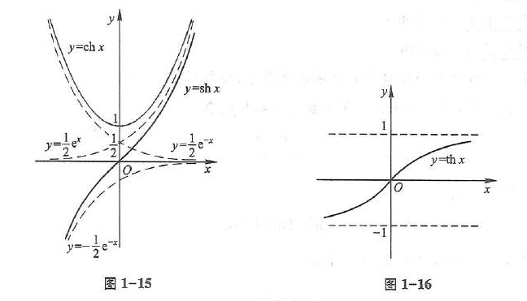
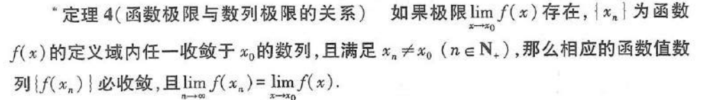
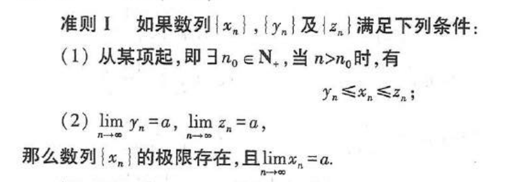
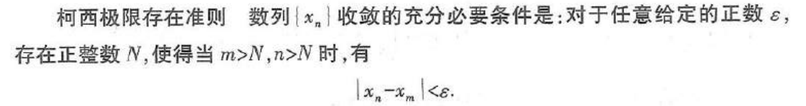
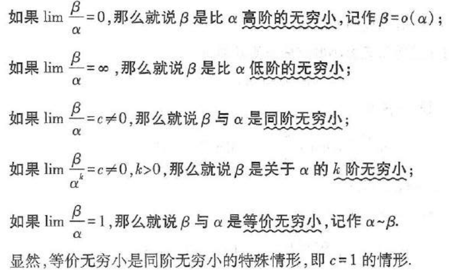

反双曲函数：
$$
\sinh(x) = \frac{e^x - e^{-x}}{2}
$$
$$
\cosh(x) = \frac{e^x + e^{-x}}{2}
$$
$$
\tanh(x) = \frac{\sinh(x)}{\cosh(x)} = \frac{e^x - e^{-x}}{e^x + e^{-x}}
$$

数列极限：$$∀ϵ>0,∃N∈N,使得对于所有的 n>N,∣a_n​−L∣<ϵ，则该数列的极限为L $$
收敛数列的性质：
- 如果数列收敛，则其极限唯一
- 如果数列收敛，数列有界
- 若数列极限为a，a>0, 则存在N，当n>N时，都有a_n >0
- 若数列收敛于a，则它的任意子数列也收敛，极限也是a

函数极限：$$函数f(x)在点a的某一去心邻域有定义，∀ϵ>0,∃δ>0,使得当 0<∣x−a∣<δ,有 ∣f(x)−L∣<ϵ$$
函数f(x)在a处极限存在的充要条件时左极限和右极限存在且相等

函数极限的性质：
- 如果函数在a处的极限存在，则极限唯一
- 局部有界性
- 局部保号性
- 

无穷小：若函数f(x)当x趋向a或无穷时极限为0，则称f(x)为当x趋向a或无穷的无穷小（无穷小是一个函数）

在自变量的同一变化过程中，函数f(x)的极限为A的充要条件时f(x)=A+α，其中α是无穷小

极限存在准则：
- 
	- 例：`lim sinx/x (x→0)  =  1`
- 准则II：单调有界数列必有极限
- 柯西极限存在准则：

无穷小的比较：

$$ x^n - y^n = (x - y) \left( x^{n-1} + x^{n-2}y + \cdots + xy^{n-2} + y^{n-1} \right)
 $$
