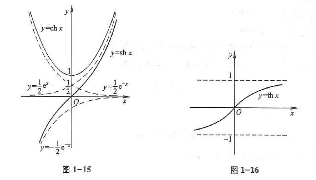
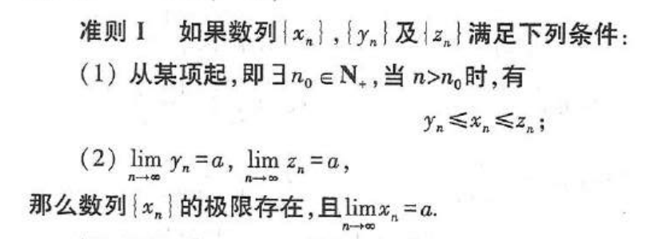
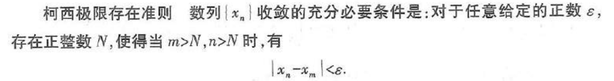
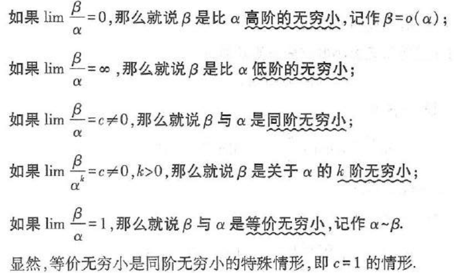
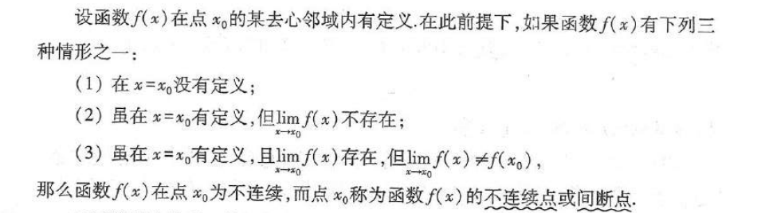
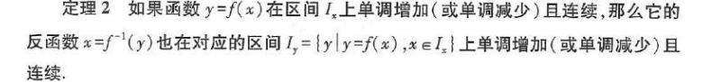
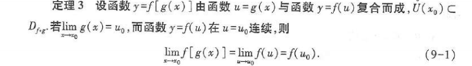
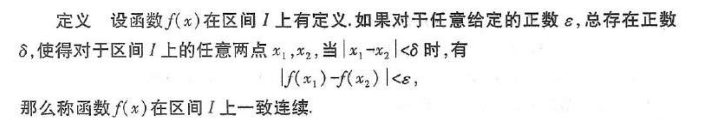

反双曲函数：
$$
\sinh(x) = \frac{e^x - e^{-x}}{2}
$$
$$
\cosh(x) = \frac{e^x + e^{-x}}{2}
$$
$$
\tanh(x) = \frac{\sinh(x)}{\cosh(x)} = \frac{e^x - e^{-x}}{e^x + e^{-x}}
$$

数列极限：$$∀ϵ>0,∃N∈N,使得对于所有的 n>N,∣a_n​−L∣<ϵ，则该数列的极限为L $$
收敛数列的性质：
- 如果数列收敛，则其极限唯一
- 如果数列收敛，数列有界
- 若数列极限为a，a>0, 则存在N，当n>N时，都有a_n >0
- 若数列收敛于a，则它的任意子数列也收敛，极限也是a

函数极限：$$函数f(x)在点a的某一去心邻域有定义，∀ϵ>0,∃δ>0,使得当 0<∣x−a∣<δ,有 ∣f(x)−L∣<ϵ$$
函数f(x)在a处极限存在的充要条件时左极限和右极限存在且相等

函数极限的性质：
- 如果函数在a处的极限存在，则极限唯一
- 局部有界性
- 局部保号性
- 

无穷小：若函数f(x)当x趋向a或无穷时极限为0，则称f(x)为当x趋向a或无穷的无穷小（无穷小是一个函数）

在自变量的同一变化过程中，函数f(x)的极限为A的充要条件时f(x)=A+α，其中α是无穷小

极限存在准则：
- 
	- 例：`lim sinx/x (x→0)  =  1`
- 准则II：单调有界数列必有极限
- 柯西极限存在准则：

无穷小的比较：

$$ x^n - y^n = (x - y) \left( x^{n-1} + x^{n-2}y + \cdots + xy^{n-2} + y^{n-1} \right)
 $$

函数的连续性：设函数 \( y = f(x) \) 在点 \( x_0 \) 的某一邻域内有定义，如果
$$
\lim_{x \to x_0} f(x) = f(x_0),
$$那么就称函数 \( f(x) \) 在点 \( x_0 \) 连续。

不连续点：

- 无穷间断点：在x0处无定义，且极限为无穷
- 震荡间断点：在无穷之间震荡
- 可去间断点：在x0处不连续，但是左极限等于右极限
- 跳跃间断点：在x0处不连续，左极限不等于右极限
	前2为第二间断点，后2为第一间断点

连续的变换性质：
- 四则运算保持连续
- 

- 

- 初等函数连续

闭区间上连续函数的性质：
- 在闭区间上连续的函数在该区间上有界且一定能取得它的最大值和最小值
- 若函数在闭区间`[a,b]`上连续且f(a)与f(b)异号，则在开区间(a,b)内至少有一点e,f(e)=0
- 若函数在闭区间`[a,b]`上连续且f(a)=A，f(b)=B，A和B不相等，则在开区间(a,b)内至少有一点e,f(e)=C，其中C在AB之间

一致连续性：

如果函数f(x)在闭区间`[a,b]`上连续，则它在该区间上一致连续

