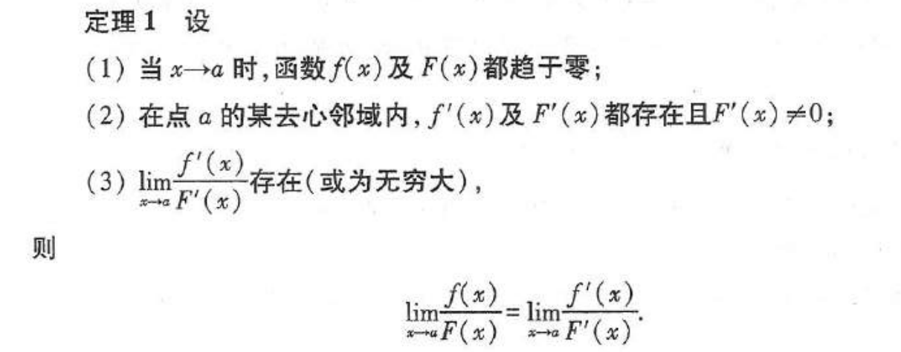
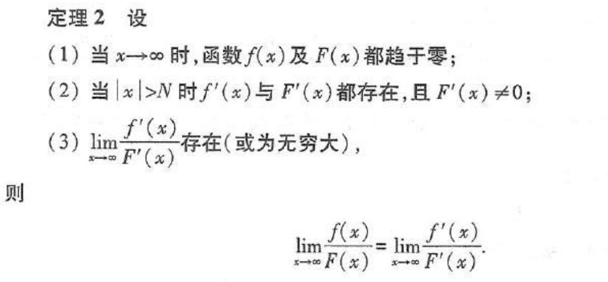
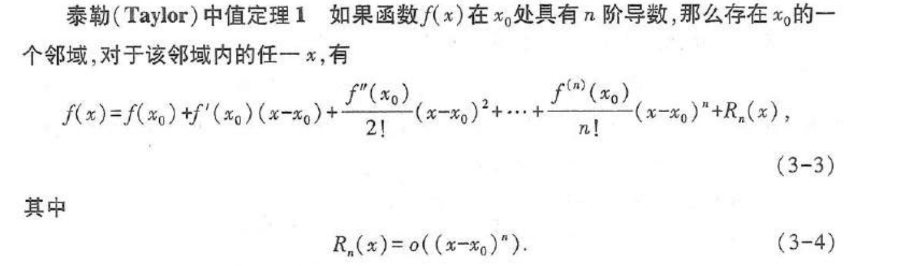
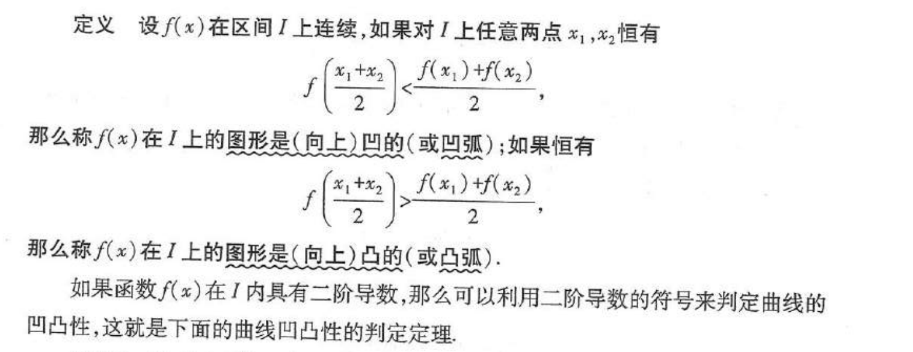
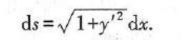
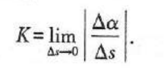
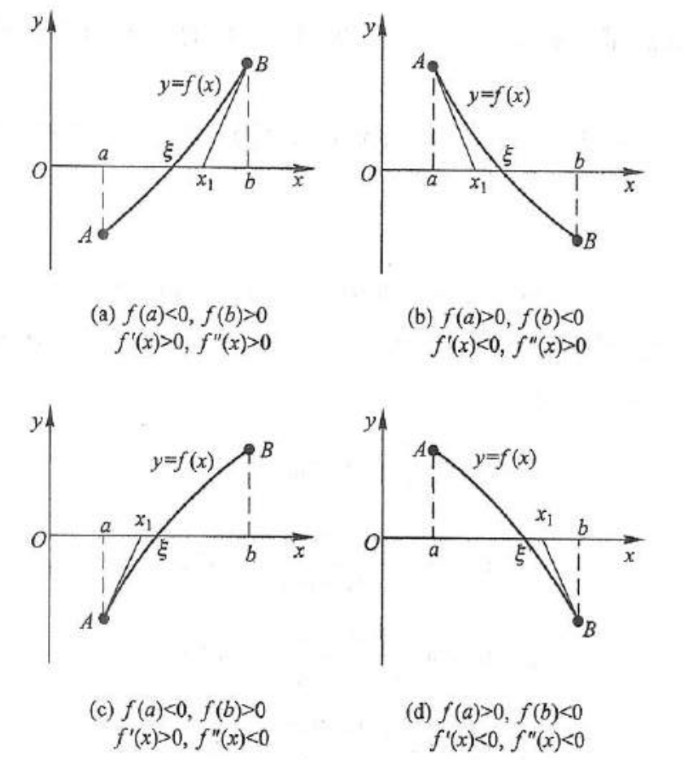
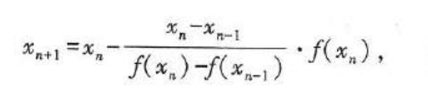

费马引理：设函数f(x)在x0的某邻域U(x0)内有定义，并且在x0处可导，如果对任意的x∈U(x0)，有`f(x)≤f(x0)/f(x)≥f(x0)`，那么`f'(x0) = 0`。x0可以叫函数的驻点/稳定点/临界点

罗尔定理：如果f(x)满足在`[a,b]`上连续，在`(a,b)`上可导，在区间端点处函数值相等，即f(a)=f(b)，则(a,b)内至少有一点e(a<e<b)，使得f'(e)=0

拉格朗日中值定理（微分中值定理）：如果f(x)满足在`[a,b]`上连续，在`(a,b)`上可导，则(a,b)内至少有一点e(a<e<b)，使得f(b)-f(a)=f'(e)(b-a)
	定理：如果函数f(x)在区间I上连续，I内可导且导数恒为0，则f(x)在区间I上是一个常数

柯西中值定理：如果f(x)，F(x)满足在`[a,b]`上连续，在`(a,b)`上可导，对任一x∈(a,b)，F'(x)≠0，则(a,b)内至少有一点e，使得`f(b)-f(a)/F(b)-F(a) = f'(e)/F'(e)`

洛必达法则：

泰勒公式：(前者叫peano余项，后者叫lagerange余项)

![[taylor2.png]]

函数的单调性：设函数y=f(x)在`[a,b]`上连续，在`(a,b)`内可导。如果在(a,b)内f'(x)≥0，且等号仅在有限多个点处成立，则函数在`[a,b]`上单调增加；如果在(a,b)内f'(x)≤0，且等号仅在有限多个点处成立，则函数在`[a,b]`上单调减少

函数的凹凸性：设函数y=f(x)在`[a,b]`上连续，在`(a,b)`内有一阶和二阶导数。如果在(a,b)内f''(x)＞0，则函数在`[a,b]`是凹函数；如果在(a,b)内f''(x)＜0，则函数在`[a,b]`是凸函数

函数的极值：设函数f(x)在点x0的某邻域U(x0)内有定义，如果对于去心邻域内的任一x，有f(x) < f(x0)，那么就称f(x0)是f(x)的一个极大值（或极小值）
- ![[高数/第三章 微分中值定理与导数的应用/rule1.png]]

- ![[高数/第三章 微分中值定理与导数的应用/rule2.png]]
- ![[高数/第三章 微分中值定理与导数的应用/rule3.png]]

弧微分公式：

曲率公式：  ![[qulv2.png]] 
其中α是切线的角度差

曲率半径：ρ = 1 / K

方程的近似解：
- 二分法：利用连续函数在正负区间内必有零点
- 切线法：
![[qiexianfa2.png]]

- 割线法：当计算f'(x)比较复杂时，

