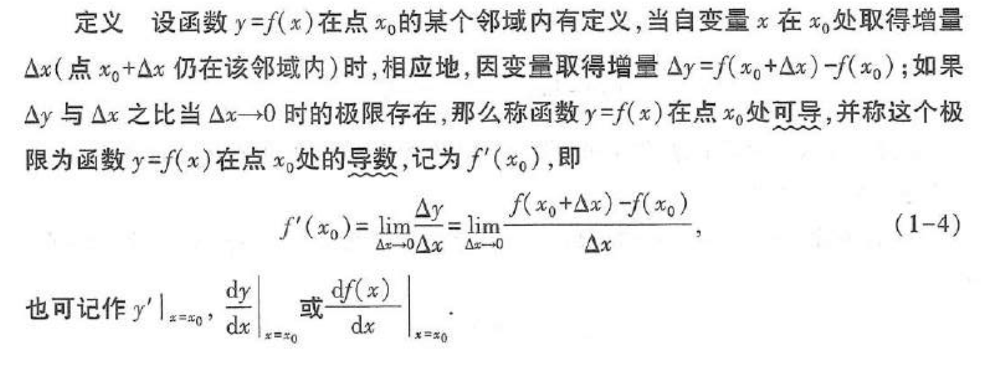
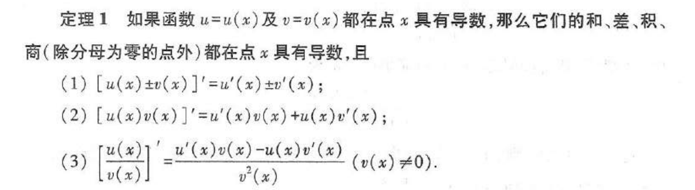
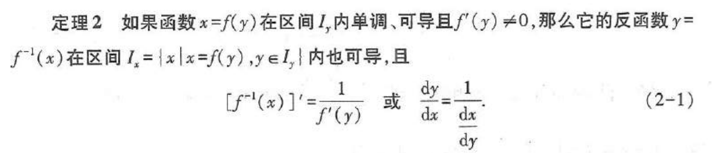
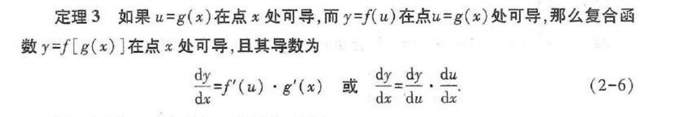
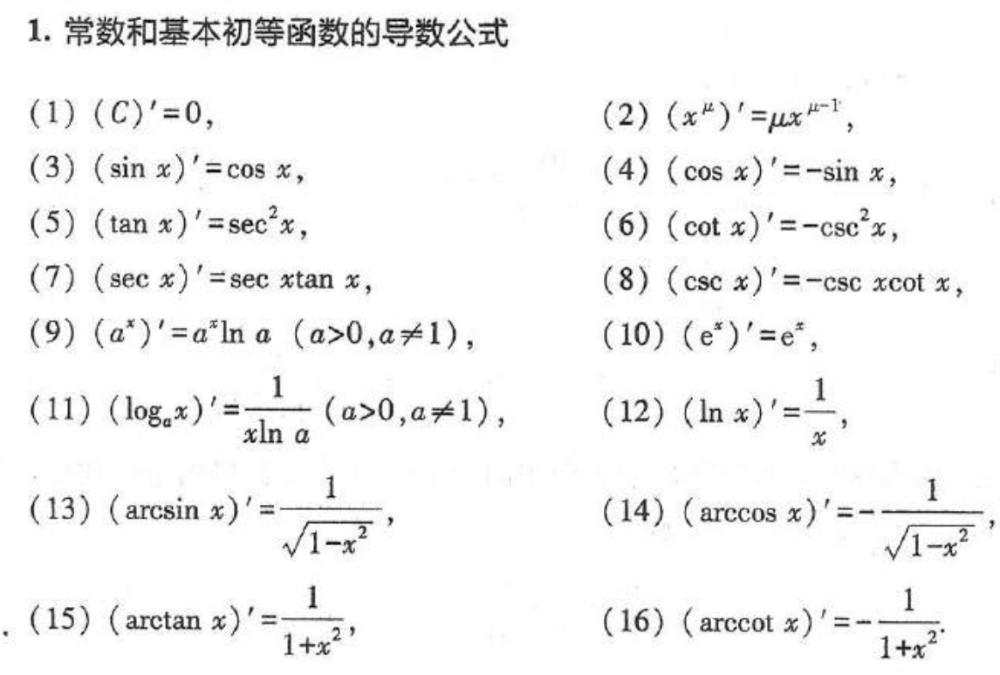
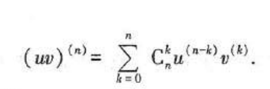
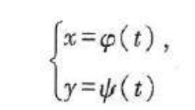
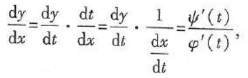
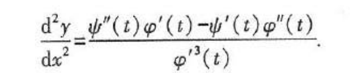
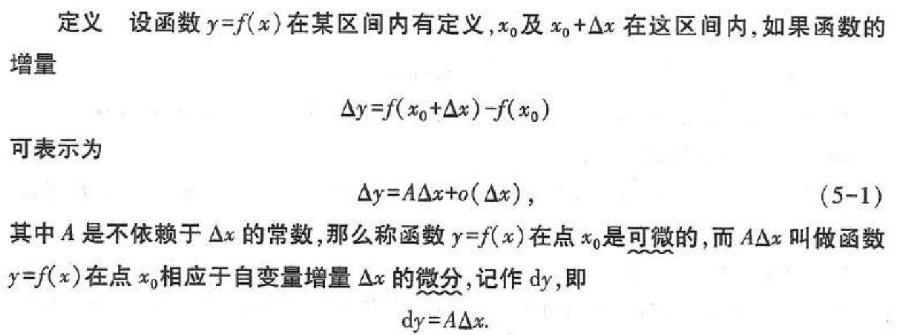

导数的定义：

导数的几何意义：切线斜率

**连续与可导的关系：可导必连续，连续未必可导（反例：绝对值函数）**

函数的求导法则：

莱布尼兹公式：

隐函数：x,y 满足方程F(x,y)=0，在一定条件下，x取某区间内的任意值时，相应地总有满足这方程的唯一y值存在，则方程F(x,y)=0在该区间内确定了一个隐函数

隐函数求导：对方程两边同时对x求导（有时候可以先对两边同时求对数再求导

参数方程确定的函数求导：
             
    

函数的微分：

这里△x可以写作dx

在此情况下，可微和可导是等价

可以用`f(x)=f(x0) + f'(x0)(x-x0)`来做近似（若取x0=0，可以得到一些近似式）

