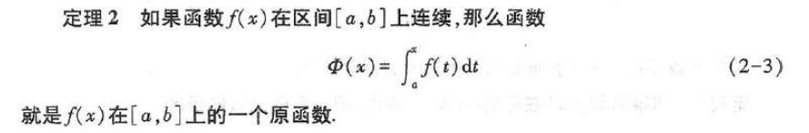
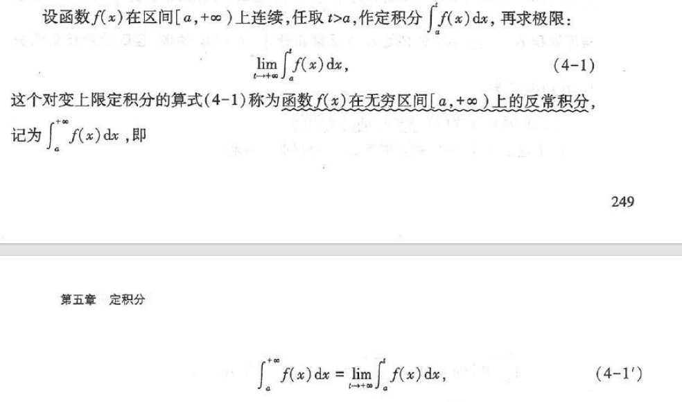

定义：

其中，该极限只与被积函数f(x)以及积分区间`[a,b]`有关

如果f(x)在区间`[a,b]`上有界，且只有有限个间断点，则f(x)在`[a,b]`上可积
这就推出可积未必连续/可导

神秘性质：
- 积分的绝对值小于等于绝对值的积分

定积分中值定理：如果f(x)在积分区间`[a,b]`上连续，则在`[a,b]`上至少存在一个点e，使得

微积分基本公式：

依然有换元法和分部积分法（跟不定积分差不多）

反常积分：

如果极限存在，则称反常积分收敛；否则发散

无穷限反常积分的审敛法：
- 如果积分的原函数在`[a,+无穷]`上有上界，则无穷限反常积分收敛
- 如果能给被积函数f(x)找出g(x)，使得f{x}≤g(x)恒成立，g(x)的无穷反常积分收敛，则f(x)的无穷反常积分收敛
- 
- 如果|f(x)|的反常积分收敛，则f(x)的反常积分收敛
- 

为了此处写的方便，将其记为T(s)
- 递推公式：T(s+1) = sT(s) (s>0)   T(n+1) = n!
- 当s趋向于+0时，T(s)趋向于正无穷
- T(s)T(1-s) = π / sin πs
- 

