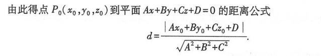

向量的数量积：点积
向量的向量积：叉乘（可以表示两个向量圈起来的三角形面积）

三个向量的混合积：`(a×b)·c`（可以表示三个向量围起来的六边形面积）

曲面方程：F(x,y,z)=0
曲线方程：满足方程组：F(x,y,z)=0 & G(x,y,z)=0

平面方程：
- 点法式方程：法向量为(A,B,C)，有一点(x0,y0,z0)在平面上，则平面为A(x-x0)+B(y-y0)+C(z-z0)=0
- 一般方程：Ax+By+Cz+D=0
- 截距式方程：x/a + x/b +x/c = 1（a,b,c分别为跟坐标轴的交点）

平面夹角：由法线夹角求得
点到平面的距离公式：

直线方程：
![[zhixian.png]]

![[zhixian2.png]]
可以通过与两个法向量垂直 即s = n1 × n2的形式来计算与两个平面平行的向量

旋转曲面方程：
![[xuanzhuanqumian 1.png]]

空间曲线在坐标面上的投影：消去方程组中的变量x，再和x=0联立（这就是投影在yOz平面的上的投影

![[高数/第八章 向量代数与空间解析几何/t1.png]]