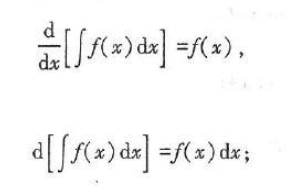
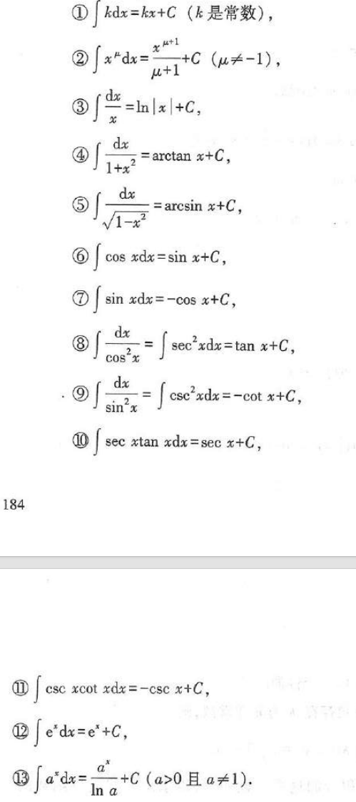
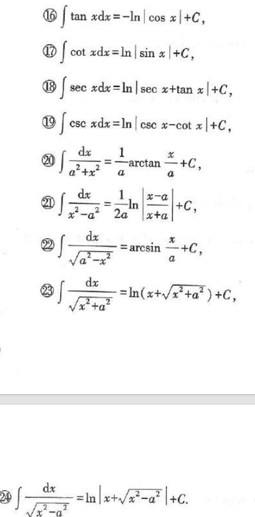
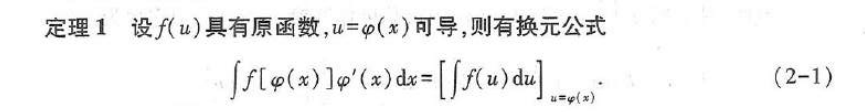
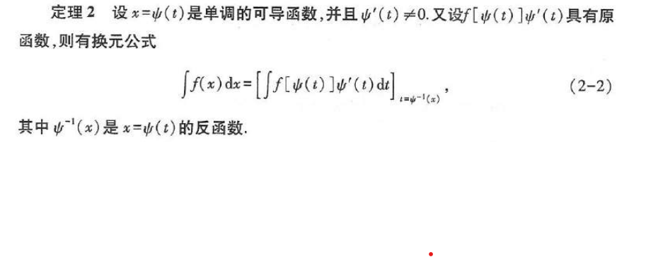
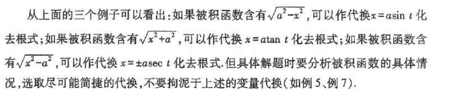

原函数：如果在区间I上，可导函数F(x)的导函数为f(x)，即对任一x∈I，都有F'(x)=f(x)或dF(x)=f(x)dx，则F(x)是f(x)在I上的原函数
原函数存在定理：连续函数一定有原函数

在区间I上，函数f(x)的带有任意常数项的原函数称为f(x)在区间I上的不定积分记作∫f(x)dx = F(x)+C

 !

 

不定积分的性质：加法可逆、常数乘可逆

换元积分法：

分部积分法：∫udv = uv - ∫vdu
	条件：v要容易求得；∫vdu要比∫udv容易求出
	被积函数是幂函数、正弦函数、幂函数和指数函数的乘积
	
有理函数的积分：两个多项式的商P(x)/Q(x)是有理函数，可以分解为两个真分式之和

